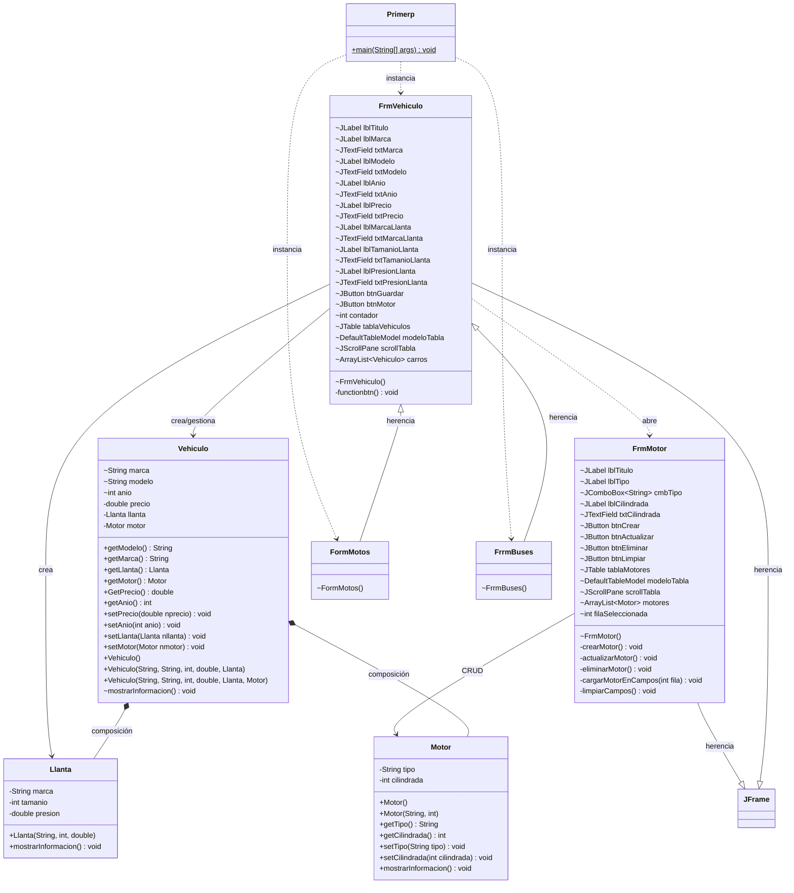

# Diagrama UML de Clases — Proyecto Primerp

## Diagrama

## Descripción de relaciones

| Relación | Tipo | Descripción |
|---|---|---|
| `Vehiculo` ◆── `Llanta` | **Composición** | Un vehículo tiene una llanta (parte esencial) |
| `Vehiculo` ◆── `Motor` | **Composición** | Un vehículo tiene un motor (parte esencial) |
| `FrmVehiculo` ◁── `FormMotos` | **Herencia** | FormMotos hereda de FrmVehiculo |
| `FrmVehiculo` ◁── `FrrmBuses` | **Herencia** | FrrmBuses hereda de FrmVehiculo |
| `FrmVehiculo` ──▷ `FrmMotor` | **Dependencia** | El formulario de vehículo abre el formulario de motor |
| `FrmMotor` ──▷ `Motor` | **Asociación** | FrmMotor realiza CRUD sobre Motor |
| `FrmVehiculo` ──▷ `JFrame` | **Herencia** | FrmVehiculo extiende JFrame (Swing) |
| `FrmMotor` ──▷ `JFrame` | **Herencia** | FrmMotor extiende JFrame (Swing) |

## Resumen de clases nuevas

### Motor
- **Atributos:** `tipo`, `cilindrada`
- **Comportamientos:** getters, setters (con validación), `mostrarInformacion()`

### FrmMotor
- **Propósito:** Formulario CRUD completo para gestionar motores
- **Operaciones:** Crear, Actualizar, Eliminar, Limpiar campos
- **Interacción:** Se abre desde el botón "Gestionar Motor" en FrmVehiculo
