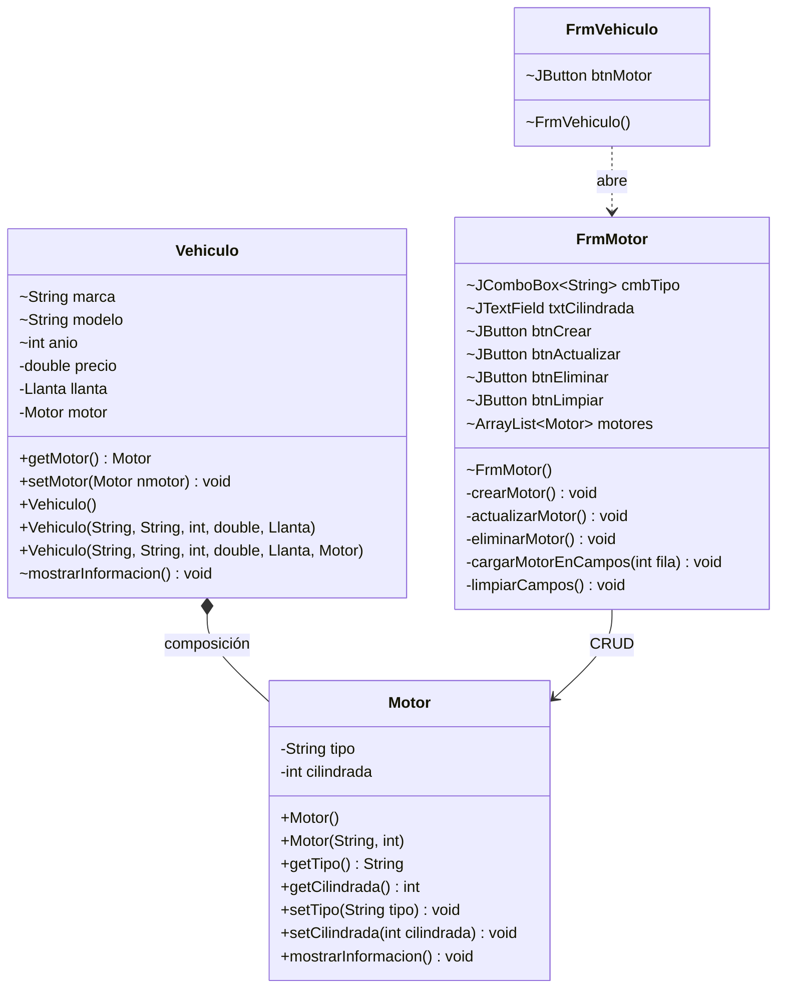

# Diagrama UML — Motor y su vínculo con Vehículo

```mermaid
classDiagram
    class Vehiculo {
        ~String marca
        ~String modelo
        ~int anio
        -double precio
        -Llanta llanta
        -Motor motor
        +getMotor() Motor
        +setMotor(Motor nmotor) void
        +Vehiculo()
        +Vehiculo(String, String, int, double, Llanta)
        +Vehiculo(String, String, int, double, Llanta, Motor)
        ~mostrarInformacion() void
    }

    class Motor {
        -String tipo
        -int cilindrada
        +Motor()
        +Motor(String, int)
        +getTipo() String
        +getCilindrada() int
        +setTipo(String tipo) void
        +setCilindrada(int cilindrada) void
        +mostrarInformacion() void
    }

    class FrmVehiculo {
        ~JButton btnMotor
        ~FrmVehiculo()
    }

    class FrmMotor {
        ~JComboBox~String~ cmbTipo
        ~JTextField txtCilindrada
        ~JButton btnCrear
        ~JButton btnActualizar
        ~JButton btnEliminar
        ~JButton btnLimpiar
        ~ArrayList~Motor~ motores
        ~FrmMotor()
        -crearMotor() void
        -actualizarMotor() void
        -eliminarMotor() void
        -cargarMotorEnCampos(int fila) void
        -limpiarCampos() void
    }

    Vehiculo *-- Motor : composición
    FrmVehiculo ..> FrmMotor : abre
    FrmMotor --> Motor : CRUD
```
