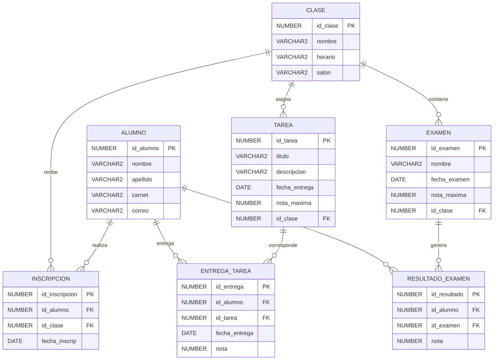

# Diagrama Entidad-Relación — Sistema Académico

## Entidades

### CLASE
Representa una clase o curso académico.

- `id_clase`: Identificador único de la clase (PK).
- `nombre`: Nombre de la clase.
- `horario`: Horario de la clase.
- `salon`: Salón donde se imparte.

### EXAMEN
Representa los exámenes asociados a una clase.

- `id_examen`: Identificador único del examen (PK).
- `nombre`: Nombre del examen.
- `fecha_examen`: Fecha en que se realiza.
- `nota_maxima`: Nota máxima posible.
- `id_clase`: Clase a la que pertenece (FK).

### ALUMNO
Representa a los estudiantes del sistema.

- `id_alumno`: Identificador único del alumno (PK).
- `nombre`: Nombre del alumno.
- `apellido`: Apellido del alumno.
- `carnet`: Número de carnet.
- `correo`: Correo electrónico.

### TAREA
Representa las tareas asignadas dentro de una clase.

- `id_tarea`: Identificador único de la tarea (PK).
- `titulo`: Título de la tarea.
- `descripcion`: Descripción de la tarea.
- `fecha_entrega`: Fecha límite de entrega.
- `nota_maxima`: Nota máxima posible.
- `id_clase`: Clase a la que pertenece (FK).

### INSCRIPCION
Relaciona a los alumnos con las clases en las que están inscritos.

- `id_inscripcion`: Identificador único de la inscripción (PK).
- `id_alumno`: Alumno inscrito (FK).
- `id_clase`: Clase en la que se inscribe (FK).
- `fecha_inscrip`: Fecha de inscripción.

### RESULTADO_EXAMEN
Registra la nota obtenida por un alumno en un examen.

- `id_resultado`: Identificador único del resultado (PK).
- `id_alumno`: Alumno que realizó el examen (FK).
- `id_examen`: Examen realizado (FK).
- `nota`: Nota obtenida.

### ENTREGA_TAREA
Registra las entregas de tareas realizadas por los alumnos.

- `id_entrega`: Identificador único de la entrega (PK).
- `id_alumno`: Alumno que entrega la tarea (FK).
- `id_tarea`: Tarea entregada (FK).
- `fecha_entrega`: Fecha en que se realizó la entrega.
- `nota`: Nota obtenida.

## Relaciones

| Relación | Cardinalidad | Descripción |
|---|---|---|
| CLASE — EXAMEN | 1:N | Una clase puede contener varios exámenes. |
| CLASE — TAREA | 1:N | Una clase puede tener varias tareas asignadas. |
| CLASE — INSCRIPCION | 1:N | Una clase puede tener varias inscripciones. |
| ALUMNO — INSCRIPCION | 1:N | Un alumno puede tener varias inscripciones. |
| ALUMNO — RESULTADO_EXAMEN | 1:N | Un alumno puede obtener varios resultados de examen. |
| EXAMEN — RESULTADO_EXAMEN | 1:N | Un examen puede generar resultados para varios alumnos. |
| ALUMNO — ENTREGA_TAREA | 1:N | Un alumno puede realizar varias entregas. |
| TAREA — ENTREGA_TAREA | 1:N | Una tarea puede tener entregas de varios alumnos. |

> **Nota:** `PK` significa Primary Key (clave primaria) y `FK` significa Foreign Key (clave foránea).
