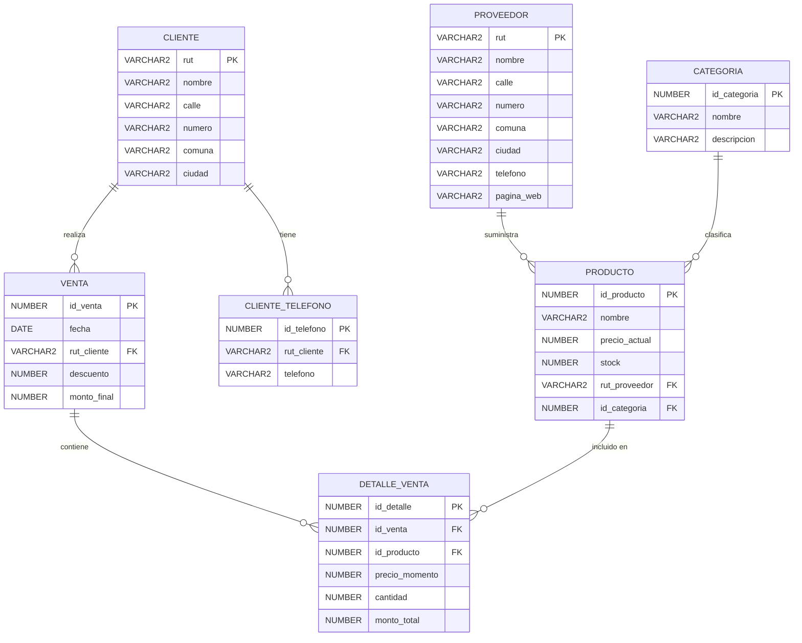

# Diagrama Entidad-Relación — Sistema de Ventas

## Entidades

### PROVEEDOR
- `rut`: Identificador único (PK)
- `nombre`: Nombre del proveedor
- `calle`, `numero`, `comuna`, `ciudad`: Dirección
- `telefono`: Teléfono de contacto
- `pagina_web`: Sitio web

### CATEGORIA
- `id_categoria`: Identificador único (PK)
- `nombre`: Nombre de la categoría
- `descripcion`: Descripción

### PRODUCTO
- `id_producto`: Identificador único (PK)
- `nombre`: Nombre del producto
- `precio_actual`: Precio vigente
- `stock`: Cantidad disponible
- `rut_proveedor`: Proveedor del producto (FK)
- `id_categoria`: Categoría del producto (FK)

### CLIENTE
- `rut`: Identificador único (PK)
- `nombre`: Nombre del cliente
- `calle`, `numero`, `comuna`, `ciudad`: Dirección

### CLIENTE_TELEFONO
- `id_telefono`: Identificador único (PK)
- `rut_cliente`: Cliente al que pertenece (FK)
- `telefono`: Número de teléfono

### VENTA
- `id_venta`: Identificador único (PK)
- `fecha`: Fecha de la venta
- `rut_cliente`: Cliente que realizó la venta (FK)
- `descuento`: Descuento aplicado
- `monto_final`: Monto total final

### DETALLE_VENTA
- `id_detalle`: Identificador único (PK)
- `id_venta`: Venta a la que pertenece (FK)
- `id_producto`: Producto vendido (FK)
- `precio_momento`: Precio del producto al momento de la venta
- `cantidad`: Cantidad vendida
- `monto_total`: Monto total por este producto

## Relaciones

| Relación | Cardinalidad | Descripción |
|---|---|---|
| PROVEEDOR — PRODUCTO | 1:N | Un proveedor suministra varios productos. |
| CATEGORIA — PRODUCTO | 1:N | Una categoría clasifica varios productos. |
| CLIENTE — CLIENTE_TELEFONO | 1:N | Un cliente puede tener varios teléfonos. |
| CLIENTE — VENTA | 1:N | Un cliente puede realizar varias ventas. |
| VENTA — DETALLE_VENTA | 1:N | Una venta contiene varios productos. |
| PRODUCTO — DETALLE_VENTA | 1:N | Un producto puede aparecer en varios detalles de venta. |

> **Nota:** `PK` = Primary Key, `FK` = Foreign Key.
