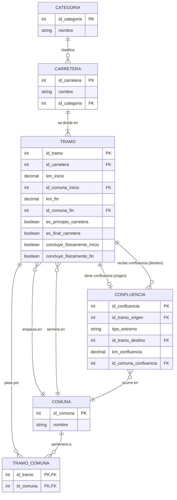
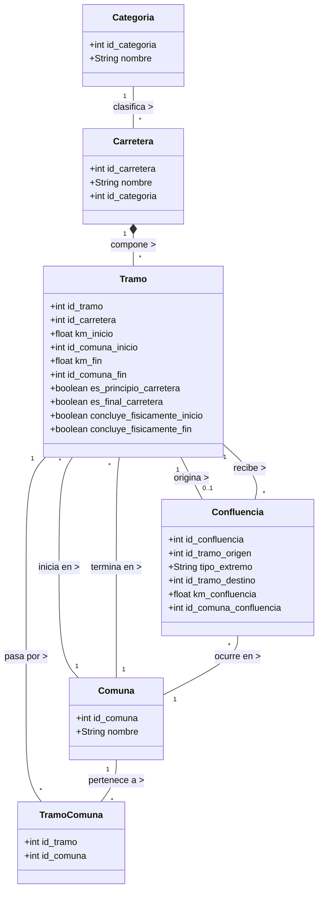

# Solución: Base de Datos de Carreteras

## 1. Identificación de Entidades, Atributos y Llaves Primarias

A partir de los requerimientos, identificamos las siguientes entidades principales:

### Entidad: `Categoria`
Agrupa los diferentes tipos de carreteras.
*   **id_categoria** (PK): Identificador único de la categoría.
*   **nombre**: Nombre de la categoría (local, comercial, regional, nacional, autovía, etc.).

### Entidad: `Carretera`
Representa una carretera del país.
*   **id_carretera** (PK): Identificador único de la carretera.
*   **nombre**: Nombre o código de la carretera.
*   **id_categoria** (FK): Llave foránea hacia `Categoria`.

### Entidad: `Comuna`
Representa las comunas por las que pasan las carreteras.
*   **id_comuna** (PK): Identificador único de la comuna.
*   **nombre**: Nombre de la comuna.

### Entidad: `Tramo`
Representa las divisiones de una carretera. Un tramo pertenece a una única carretera.
*   **id_tramo** (PK): Identificador único del tramo.
*   **id_carretera** (FK): Carretera a la que pertenece el tramo.
*   **km_inicio**: Kilómetro de la carretera donde empieza el tramo.
*   **id_comuna_inicio** (FK): Comuna donde empieza el tramo.
*   **km_fin**: Kilómetro de la carretera donde termina el tramo.
*   **id_comuna_fin** (FK): Comuna donde termina el tramo.
*   **es_principio_carretera**: Booleano, indica si el tramo es el inicio de la carretera completa.
*   **es_final_carretera**: Booleano, indica si el tramo es el final de la carretera completa.
*   **concluye_fisicamente_inicio**: Booleano, indica si al inicio termina físicamente (TRUE) o confluye (FALSE).
*   **concluye_fisicamente_fin**: Booleano, indica si al final termina físicamente (TRUE) o confluye (FALSE).

### Entidad: `Tramo_Comuna` (Relación Pasa por)
Tabla intermedia para representar que un tramo puede pasar por varias comunas (además de la de inicio y fin).
*   **id_tramo** (FK, PK)
*   **id_comuna** (FK, PK)

### Entidad: `Confluencia`
Almacena la información de los tramos que son principio o final de carretera y que NO concluyen físicamente, sino que confluyen en otra carretera.
*   **id_confluencia** (PK): Identificador único.
*   **id_tramo_origen** (FK): El tramo que es principio/final y confluye.
*   **tipo_extremo**: Indica si la confluencia ocurre al 'INICIO' o al 'FIN' del tramo origen.
*   **id_tramo_destino** (FK): El tramo con el que confluye.
*   **km_confluencia**: Kilómetro exacto donde ocurre la confluencia.
*   **id_comuna_confluencia** (FK): Comuna donde ocurre la confluencia.

---

## 2. Diagrama Entidad-Relación (E/R)



---

## 3. Diagrama UML de Clases



---

## 4. Código DDL (SQL)

```sql
-- Creación de la base de datos
CREATE DATABASE IF NOT EXISTS sistema_carreteras;
USE sistema_carreteras;

-- Tabla Categoria
CREATE TABLE Categoria (
    id_categoria INT AUTO_INCREMENT PRIMARY KEY,
    nombre VARCHAR(50) NOT NULL -- Ej: local, comercial, regional, nacional, autovía
);

-- Tabla Comuna
CREATE TABLE Comuna (
    id_comuna INT AUTO_INCREMENT PRIMARY KEY,
    nombre VARCHAR(100) NOT NULL
);

-- Tabla Carretera
CREATE TABLE Carretera (
    id_carretera INT AUTO_INCREMENT PRIMARY KEY,
    nombre VARCHAR(100) NOT NULL,
    id_categoria INT NOT NULL,
    CONSTRAINT fk_carretera_categoria FOREIGN KEY (id_categoria) REFERENCES Categoria(id_categoria)
);

-- Tabla Tramo
CREATE TABLE Tramo (
    id_tramo INT AUTO_INCREMENT PRIMARY KEY,
    id_carretera INT NOT NULL,
    km_inicio DECIMAL(10,2) NOT NULL,
    id_comuna_inicio INT NOT NULL,
    km_fin DECIMAL(10,2) NOT NULL,
    id_comuna_fin INT NOT NULL,
    
    -- Banderas para saber si es principio o final de carretera completa
    es_principio_carretera BOOLEAN DEFAULT FALSE,
    es_final_carretera BOOLEAN DEFAULT FALSE,
    
    -- Banderas para saber si concluye físicamente (Si es falso y es principio/fin, entonces confluye)
    concluye_fisicamente_inicio BOOLEAN DEFAULT TRUE,
    concluye_fisicamente_fin BOOLEAN DEFAULT TRUE,

    CONSTRAINT fk_tramo_carretera FOREIGN KEY (id_carretera) REFERENCES Carretera(id_carretera),
    CONSTRAINT fk_tramo_comuna_inicio FOREIGN KEY (id_comuna_inicio) REFERENCES Comuna(id_comuna),
    CONSTRAINT fk_tramo_comuna_fin FOREIGN KEY (id_comuna_fin) REFERENCES Comuna(id_comuna)
);

-- Tabla intermedia: Un tramo puede pasar por varias comunas
CREATE TABLE Tramo_Comuna (
    id_tramo INT,
    id_comuna INT,
    PRIMARY KEY (id_tramo, id_comuna),
    CONSTRAINT fk_tc_tramo FOREIGN KEY (id_tramo) REFERENCES Tramo(id_tramo),
    CONSTRAINT fk_tc_comuna FOREIGN KEY (id_comuna) REFERENCES Comuna(id_comuna)
);

-- Tabla Confluencia: Para los tramos que son principio/final y confluyen en otra carretera
CREATE TABLE Confluencia (
    id_confluencia INT AUTO_INCREMENT PRIMARY KEY,
    id_tramo_origen INT NOT NULL, -- El tramo que termina/empieza y confluye
    tipo_extremo ENUM('INICIO', 'FIN') NOT NULL, -- Determina si la confluencia pasa al inicio o al fin del tramo
    
    id_tramo_destino INT NOT NULL, -- El tramo sobre el cual confluye
    km_confluencia DECIMAL(10,2) NOT NULL,
    id_comuna_confluencia INT NOT NULL,
    
    CONSTRAINT fk_conf_tramo_origen FOREIGN KEY (id_tramo_origen) REFERENCES Tramo(id_tramo),
    CONSTRAINT fk_conf_tramo_destino FOREIGN KEY (id_tramo_destino) REFERENCES Tramo(id_tramo),
    CONSTRAINT fk_conf_comuna FOREIGN KEY (id_comuna_confluencia) REFERENCES Comuna(id_comuna),
    
    -- Evitar que un mismo extremo de un tramo origen tenga más de una confluencia
    CONSTRAINT uq_tramo_extremo UNIQUE (id_tramo_origen, tipo_extremo)
);
```
